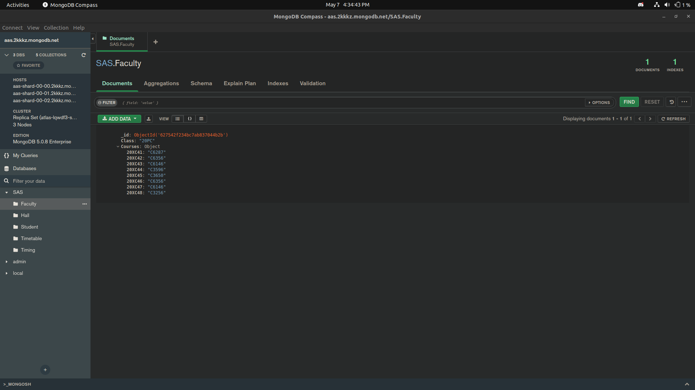
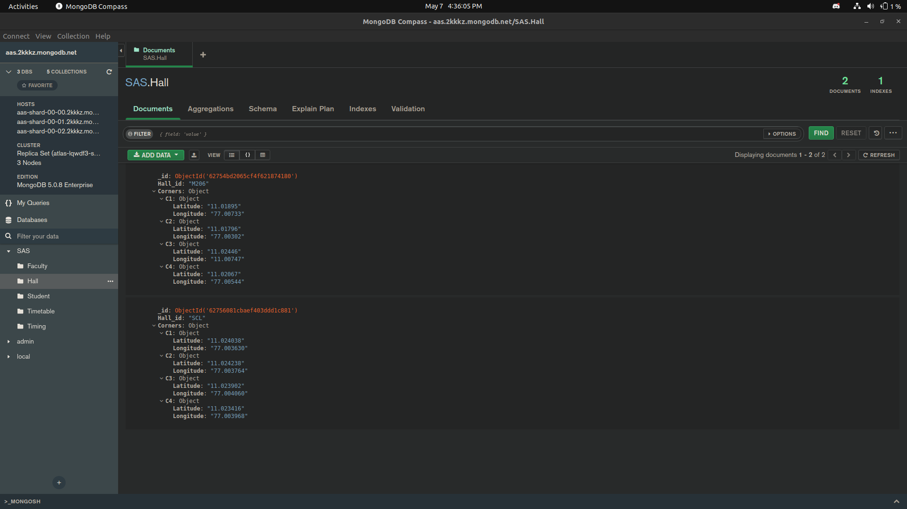
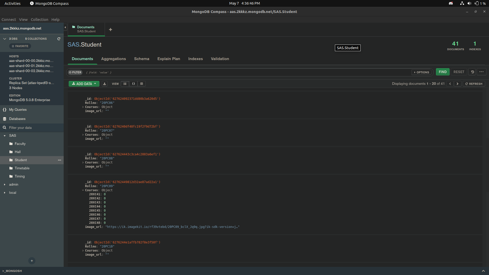
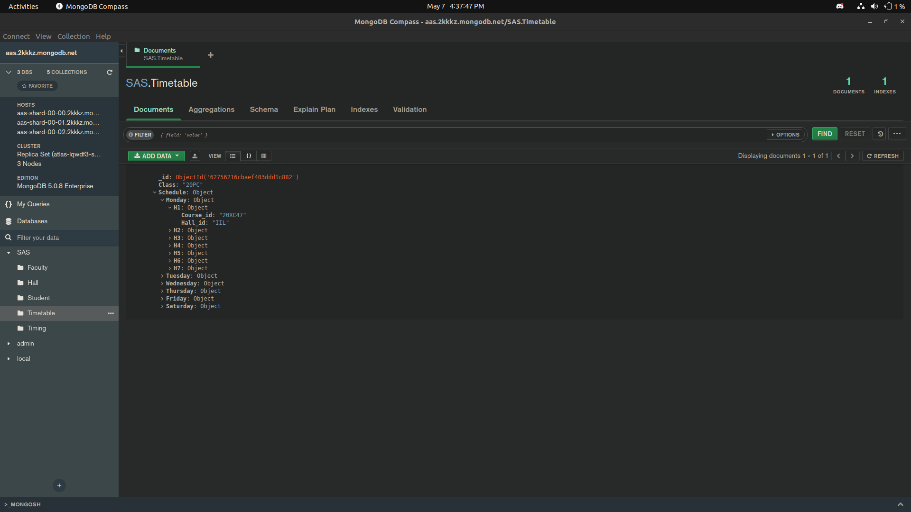
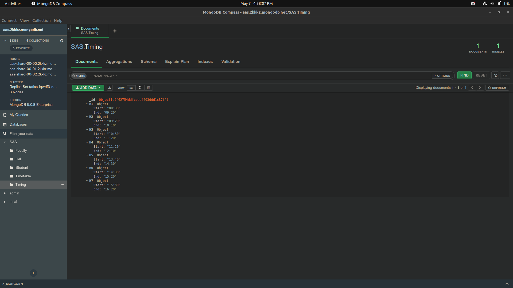

# AUTOMATED ATTENDANCE SYSTEM

#### TEAM : INCOGNITO
#### TEAM MEMBERS : 
#### 20PC16 - HARISH NARAYAN B
#### 20PC22 - NAVIN KRISHNA T
#### 20PC37 - VETRIVEL M D

NOTE : Two repositories are used for the project. One for the frontend and another for the backend. Their links are given below. 
FRONTEND : https://github.com/Vetrivel-Hari/Automatic-Attendance-System-Frontend-.git  
BACKEND : https://github.com/Vetrivel-Hari/Automatic-Attendance-System-Backend-.git  

## SOLUTION PROPOSED
The objective of the solution is to reduce proxying, reduce time and effort taken to record the attendance.
The above mentioned objective is achieved by :
<ul>
  <li>Verifying and authenticating the student identity</li>
  <li>Verifying the current location of the student</li>
</ul>
<b> Verification and authentication of student identity </b> is achieved using the <b> facial recognition </b> of the student along with
their roll number.  
<b> Student's current location </b> is verified by collecting their current <b> latitude </b> and <b> longitude </b> coordinates.  

## ADVANTAGES
<ul>
  <li>Affordable</li>
  <li>OS Independent and Device Independent (Can be used in any OS as it is hosted in web)</li>
  <li>Students can post attendance from any device even if they forgot their devices at home</li>
</ul>

## DEMO VIDEO
DRIVE LINK : https://drive.google.com/file/d/1rwdYpvpI4OtBLmW_PB0r7qA40F4DTQZb/view?usp=drivesdk

## BACKEND

### WORKING
This repo contains the flask application that handles the working of backend in the automated attendance system.  

#### API ENDPOINTS
##### /api/attendance (POST) : 
This api endpoint receives the roll number of the student, current latitude and longitude, image of the student and timestamp when the
request was made. With the given timestamp and the roll number of the student, the hall and course code along with the faculty for which attendance needs to be recorded is identified with the help of timetable stored in the database.   
The <b> facial image </b> received from the frontend is compared with the already recorded facial image of that particular student available in the database in order to <b> verify the identity of the student </b>.   
The coordinates collected is compared with the already stored four corner coordinates of each hall. If the collected point lies in between the
four coordinates, then it can be confirmed that the student is within the classroom.   
If the above mentioned verifications are successfully passed then the student is provided attendance for that particular course.  

### APIs USED
<ul>
  <li>ImageKit.io</li>
  <li>facepplib</li>
  <li>pymongo</li>
</ul>

### TOOLS USED
<ul>
  <li>Python Flask</li>
  <li>MongoDB</li>
</ul>

### DEPLOYMENT - HEROKU
HOSTED LINK : https://automatic-attendance-system-3.herokuapp.com/api/attendance  
NOTE : To use the web application use the link given below  
LINK : https://aas-vetrivel-hari.vercel.app/  
MongoDB is hosted using MongoDB Atlas.  

### SCREENSHOTS OF DATABASE

### FUTURE UPDATES
Dedicated web app for faculty, so that any classroom or attendance changes can be recorded manually.
